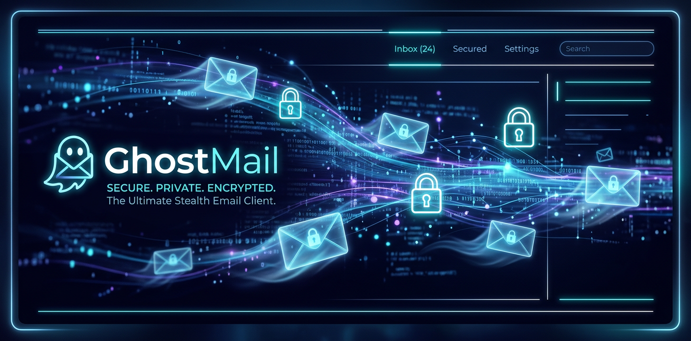

<p align="center">
  
</p>

<p align="center">
  
  
  
  
  
  
</p>

---

# 👻 GhostMail — Anonymous & Ephemeral Mail Client Studio

**GhostMail** is a privacy-first, client-side email interface engineered with **React 19**, **TypeScript**, **Zustand**, and **Tailwind CSS 4**. Designed for high-velocity power users who require ephemeral mail workflows, keyboard shortcuts, label tagging, and full offline caching.

---

## ✨ Features Breakdown

| Feature | Description |
| :--- | :--- |
| 📬 **Inbox Orchestration** | Full Gmail-style category management (Inbox, Sent, Drafts, Snoozed, Spam, Trash) with instant filtering. |
| 🏷️ **Custom Labels** | Interactive label creation, color tagging, and multi-folder email categorisation. |
| ⚡ **Power User Command Palette** | Instant navigation modal (`Cmd+K` / `/`) to execute actions across emails and state stores. |
| ⏰ **Smart Snooze** | Client-side timer scheduling to snooze non-urgent emails for later review. |
| 🔐 **Privacy First** | Local storage encryption option, zero tracking telemetries, and dark mode support. |

---

## 🛠️ Architecture & Tech Stack

- **Frontend:** React 19 + TypeScript, Vite 6, Tailwind CSS 4
- **State Store:** Zustand (atomic global state store with local persistence)
- **Animations:** Motion (Framer Motion successor)
- **Icons:** Lucide React

---

## 🚀 Quick Start

```bash
# Clone repository
git clone https://github.com/LIN4CRE/GhostMail.git
cd GhostMail

# Install dependencies
npm install

# Launch Vite dev server
npm run dev

# Build production bundle
npm run build
```

---

## 👨‍💻 Developer Profile

**David Linacre** — *Principal Infrastructure Engineer & DevOps Architect*  
- 🌐 [linacre.site](https://www.linacre.site)  
- 🐙 [GitHub Profile](https://github.com/LIN4CRE)  
- ☕ [Sponsor on PayPal](https://paypal.me/DLinacre16)  

---

## 📄 License
This project is open-source under the [MIT License](LICENSE).
